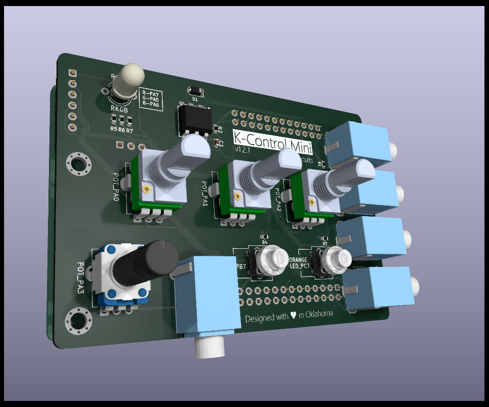

# K-Control Mini
K-Control Mini for the Ksoloti Core.

Features:
- MIDI In/Out via 3.5mm TRS Jacks (Type A )
- Stereo Audio In/Out via 3.5mm TRS Jacks
- Headphone Out via 3.5mm TRS Jack
- 3x 10k Pots
- 1x 10k Pot with Center Detent
- RGB LED
- 2x Push Button/LED Combo (Blue and Orange)

---
Ksoloti is based on the Axoloti by Johannes Taelman (johannes.taelman@gmail.com)

Template by [@sebiik](https://github.com/sebiik)

[Axoloit website](http://www.axoloti.com/)

[Ksoloiti website](https://ksoloti.github.io/index.html)

